\# 软件架构设计文档


\## 技术选型


| 层级 | 选择 | 理由 |

|------|------|------|

| 前端框架 | React Native / 小程序 | 跨平台，贴近校园用户使用习惯 |

| 后端框架 | Spring Boot 3.x + MyBatis | 生态成熟，开发效率高，适合RESTful API |

| 数据库 | MySQL 8.0 | 关系型数据，事务支持好，适合订单/支付场景 |

| 部署方式 | Docker Compose | 环境一致，方便团队协作 |


\## 系统架构图

```mermaid

graph TB

&#x20;   A\[用户端 小程序/App] -->|HTTP/WebSocket| B\[Spring Boot 后端]

&#x20;   B --> C\[MySQL 数据库]

&#x20;   B --> D\[第三方支付 API]

&#x20;   B --> E\[地图 API]

&#x20;   B --> F\[消息推送服务]

```


\## 后端架构

```mermaid

graph LR

&#x20;   A\[Controller层] --> B\[Service层]

&#x20;   B --> C\[Mapper层]

&#x20;   C --> D\[MySQL]

&#x20;   A --> E\[DTO/VO]

&#x20;   C --> F\[Entity]

```


\## 系统交互流程

```mermaid

sequenceDiagram

&#x20;   用户->>前端: 发布任务

&#x20;   前端->>Controller: POST /api/tasks

&#x20;   Controller->>Service: 处理业务逻辑

&#x20;   Service->>Mapper: 写入数据库

&#x20;   Mapper-->>Service: 返回结果

&#x20;   Service-->>Controller: 返回VO

&#x20;   Controller-->>前端: 返回成功响应

&#x20;   前端-->>用户: 显示发布成功

```



