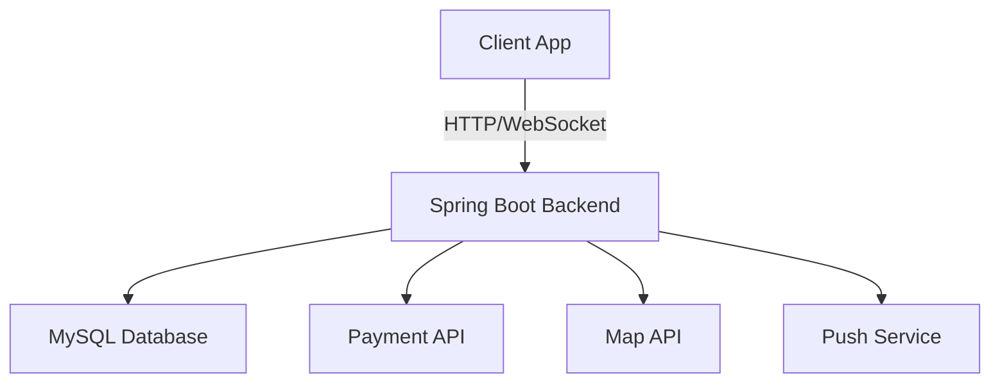
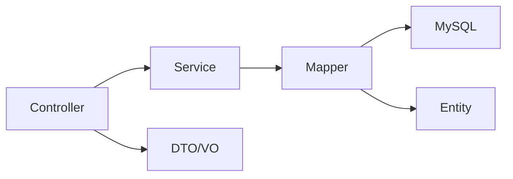
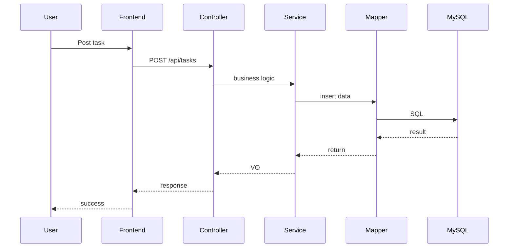

# 软件架构设计文档

## 技术选型

| 层级 | 选择 | 理由 |
|------|------|------|
| 前端框架 | React Native / 小程序 | 跨平台，贴近校园用户使用习惯 |
| 后端框架 | Spring Boot 3.x + MyBatis | 生态成熟，开发效率高，适合RESTful API |
| 数据库 | MySQL 8.0 | 关系型数据，事务支持好，适合订单/支付场景 |
| 部署方式 | Docker Compose | 环境一致，方便团队协作 |

## 系统架构图

## 后端架构

## 系统交互流程

