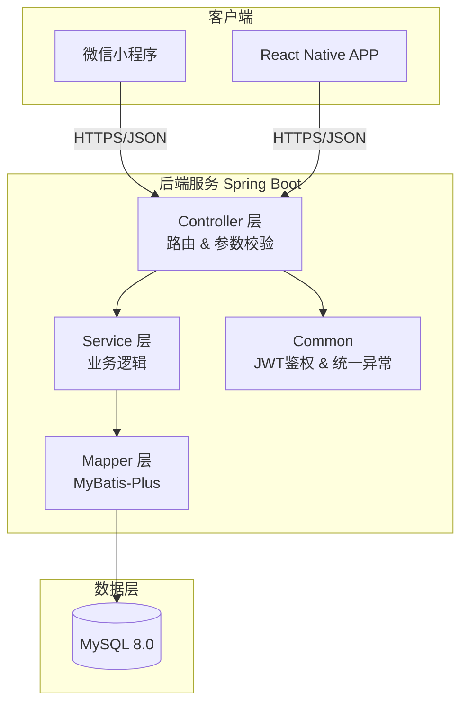
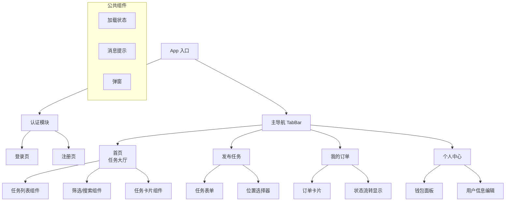
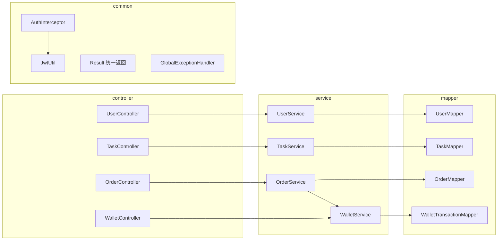
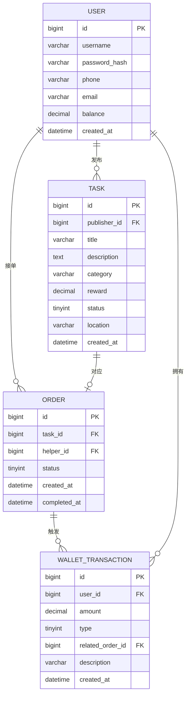
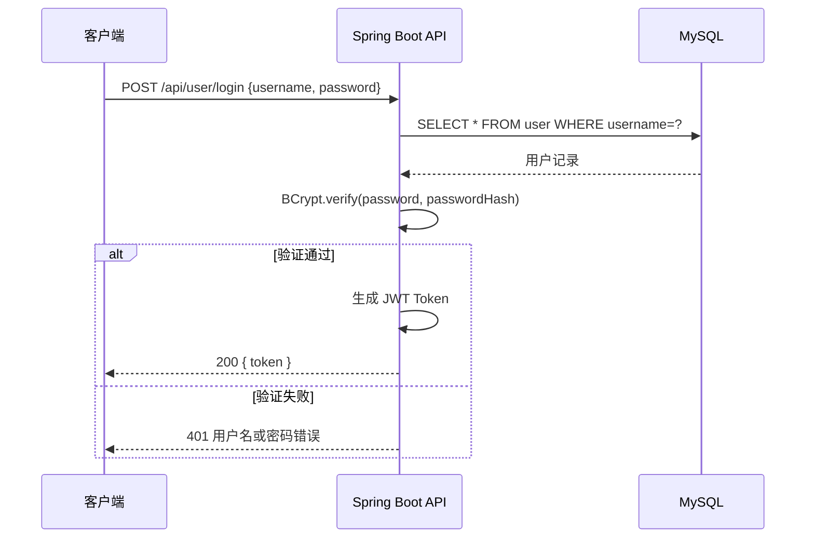
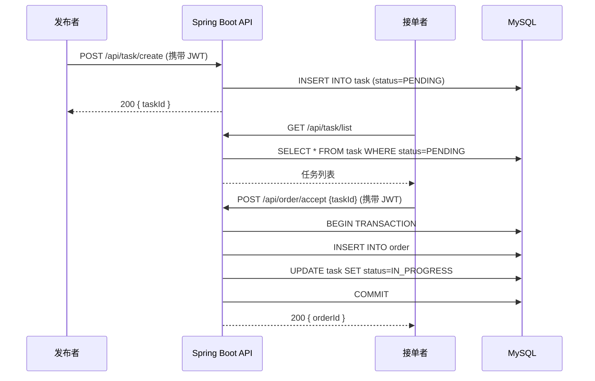
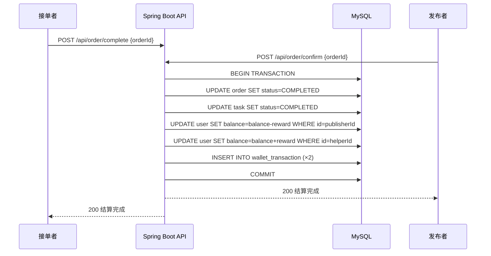

# 软件架构设计文档 — HelpMate

## 1. 系统概述

HelpMate 是面向在校学生的跑腿与互助平台。用户可以发布取快递、送餐、代购、互助等任务，接单者完成任务后通过平台钱包结算报酬。

## 2. 技术选型

| 层级 | 选择 | 理由 |
|------|------|------|
| 前端框架 | React Native + 微信小程序 | 跨平台覆盖 iOS/Android/微信生态；校园用户微信使用率高，小程序无需下载，降低使用门槛 |
| 后端框架 | Spring Boot 3.x | 生态成熟、开箱即用、与 MyBatis-Plus 配合良好；团队熟悉 Java 技术栈 |
| 数据库 | MySQL 8.0 | 关系型数据库满足业务强一致性需求；支持 JSON 字段、窗口函数等现代特性 |
| 部署方式 | Docker Compose | 本地/生产环境一致性；一键启动所有服务（后端 + MySQL）；便于团队协作 |

## 3. 系统架构图

## 4. 前端架构（页面/组件结构）

## 5. 后端架构（服务/模块划分）

### 模块说明

| 模块 | 说明 |
|------|------|
| `user` | 用户注册、登录、信息管理、JWT 签发 |
| `task` | 任务发布、查询、状态管理（待接单/进行中/已完成/已取消） |
| `order` | 接单、取消、完成确认、订单状态机 |
| `wallet` | 余额查询、充值、提现、结算流水记录 |
| `common` | 统一返回体 `Result<T>`、JWT 工具、全局异常处理、登录拦截器 |

## 6. 数据库设计（ER 图）

> 详细设计见 [database.md](./database.md)

## 7. 系统交互流程

### 7.1 用户登录流程

### 7.2 发布任务 & 接单流程

### 7.3 完成任务 & 钱包结算流程

