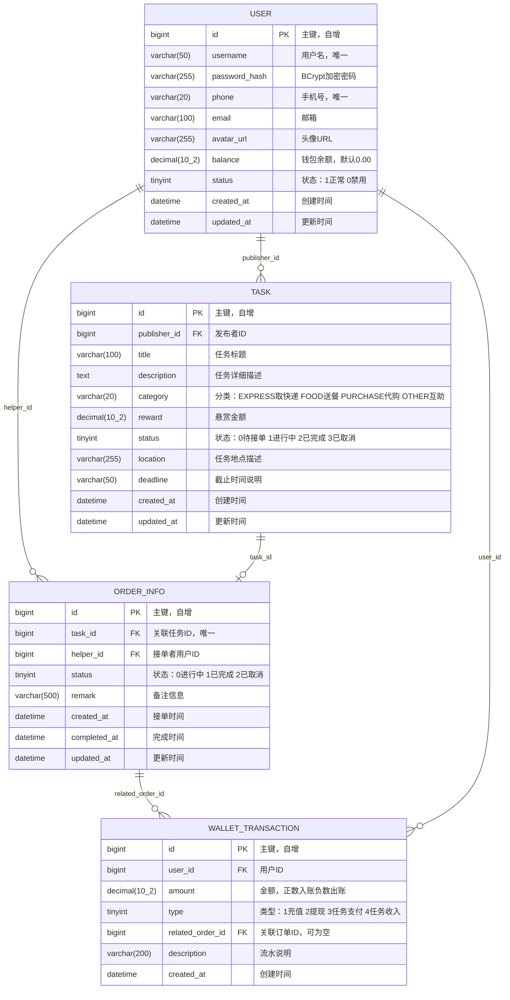

# 数据库设计文档 — HelpMate

## 1. 数据库信息

| 项目 | 说明 |
|------|------|
| 数据库类型 | MySQL 8.0 |
| 字符集 | utf8mb4 |
| 排序规则 | utf8mb4_unicode_ci |
| 数据库名 | `helpmate` |

## 2. ER 图



## 3. 数据表详细说明

### 3.1 user（用户表）

| 字段 | 类型 | 约束 | 说明 |
|------|------|------|------|
| id | BIGINT | PK, AUTO_INCREMENT | 主键 |
| username | VARCHAR(50) | NOT NULL, UNIQUE | 用户名 |
| password_hash | VARCHAR(255) | NOT NULL | BCrypt 加密密码 |
| phone | VARCHAR(20) | UNIQUE | 手机号 |
| email | VARCHAR(100) | | 邮箱 |
| avatar_url | VARCHAR(255) | | 头像地址 |
| balance | DECIMAL(10,2) | NOT NULL, DEFAULT 0.00 | 钱包余额 |
| status | TINYINT | NOT NULL, DEFAULT 1 | 1=正常, 0=禁用 |
| created_at | DATETIME | NOT NULL | 创建时间 |
| updated_at | DATETIME | NOT NULL | 更新时间 |

### 3.2 task（任务表）

| 字段 | 类型 | 约束 | 说明 |
|------|------|------|------|
| id | BIGINT | PK, AUTO_INCREMENT | 主键 |
| publisher_id | BIGINT | NOT NULL, FK→user.id | 发布者 |
| title | VARCHAR(100) | NOT NULL | 标题 |
| description | TEXT | | 详细描述 |
| category | VARCHAR(20) | NOT NULL | EXPRESS/FOOD/PURCHASE/OTHER |
| reward | DECIMAL(10,2) | NOT NULL | 悬赏金额 |
| status | TINYINT | NOT NULL, DEFAULT 0 | 0=待接单, 1=进行中, 2=已完成, 3=已取消 |
| location | VARCHAR(255) | | 地点描述 |
| deadline | VARCHAR(50) | | 截止时间说明 |
| created_at | DATETIME | NOT NULL | 创建时间 |
| updated_at | DATETIME | NOT NULL | 更新时间 |

### 3.3 order_info（订单表）

> 表名用 `order_info` 避开 MySQL 保留字 `ORDER`

| 字段 | 类型 | 约束 | 说明 |
|------|------|------|------|
| id | BIGINT | PK, AUTO_INCREMENT | 主键 |
| task_id | BIGINT | NOT NULL, UNIQUE, FK→task.id | 关联任务（一任务一订单） |
| helper_id | BIGINT | NOT NULL, FK→user.id | 接单者 |
| status | TINYINT | NOT NULL, DEFAULT 0 | 0=进行中, 1=已完成, 2=已取消 |
| remark | VARCHAR(500) | | 备注 |
| created_at | DATETIME | NOT NULL | 接单时间 |
| completed_at | DATETIME | | 完成时间 |
| updated_at | DATETIME | NOT NULL | 更新时间 |

### 3.4 wallet_transaction（钱包流水表）

| 字段 | 类型 | 约束 | 说明 |
|------|------|------|------|
| id | BIGINT | PK, AUTO_INCREMENT | 主键 |
| user_id | BIGINT | NOT NULL, FK→user.id | 用户 |
| amount | DECIMAL(10,2) | NOT NULL | 金额，正数=收入，负数=支出 |
| type | TINYINT | NOT NULL | 1=充值, 2=提现, 3=支付任务, 4=接单收入 |
| related_order_id | BIGINT | | 关联订单（可为空） |
| description | VARCHAR(200) | | 流水说明 |
| created_at | DATETIME | NOT NULL | 创建时间 |

## 4. 建表 SQL

```sql
-- 创建数据库
CREATE DATABASE IF NOT EXISTS helpmate
  DEFAULT CHARACTER SET utf8mb4
  DEFAULT COLLATE utf8mb4_unicode_ci;

USE helpmate;

-- =====================
-- 用户表
-- =====================
CREATE TABLE IF NOT EXISTS user (
    id          BIGINT          NOT NULL AUTO_INCREMENT COMMENT '主键',
    username    VARCHAR(50)     NOT NULL COMMENT '用户名',
    password_hash VARCHAR(255)  NOT NULL COMMENT 'BCrypt加密密码',
    phone       VARCHAR(20)     DEFAULT NULL COMMENT '手机号',
    email       VARCHAR(100)    DEFAULT NULL COMMENT '邮箱',
    avatar_url  VARCHAR(255)    DEFAULT NULL COMMENT '头像URL',
    balance     DECIMAL(10, 2)  NOT NULL DEFAULT 0.00 COMMENT '钱包余额',
    status      TINYINT         NOT NULL DEFAULT 1 COMMENT '状态：1正常 0禁用',
    created_at  DATETIME        NOT NULL DEFAULT CURRENT_TIMESTAMP COMMENT '创建时间',
    updated_at  DATETIME        NOT NULL DEFAULT CURRENT_TIMESTAMP ON UPDATE CURRENT_TIMESTAMP COMMENT '更新时间',
    PRIMARY KEY (id),
    UNIQUE KEY uk_username (username),
    UNIQUE KEY uk_phone (phone)
) ENGINE=InnoDB DEFAULT CHARSET=utf8mb4 COMMENT='用户表';

-- =====================
-- 任务表
-- =====================
CREATE TABLE IF NOT EXISTS task (
    id            BIGINT          NOT NULL AUTO_INCREMENT COMMENT '主键',
    publisher_id  BIGINT          NOT NULL COMMENT '发布者用户ID',
    title         VARCHAR(100)    NOT NULL COMMENT '任务标题',
    description   TEXT            DEFAULT NULL COMMENT '任务详细描述',
    category      VARCHAR(20)     NOT NULL COMMENT '分类：EXPRESS取快递 FOOD送餐 PURCHASE代购 OTHER互助',
    reward        DECIMAL(10, 2)  NOT NULL COMMENT '悬赏金额',
    status        TINYINT         NOT NULL DEFAULT 0 COMMENT '状态：0待接单 1进行中 2已完成 3已取消',
    location      VARCHAR(255)    DEFAULT NULL COMMENT '任务地点描述',
    deadline      VARCHAR(50)     DEFAULT NULL COMMENT '截止时间说明',
    created_at    DATETIME        NOT NULL DEFAULT CURRENT_TIMESTAMP COMMENT '创建时间',
    updated_at    DATETIME        NOT NULL DEFAULT CURRENT_TIMESTAMP ON UPDATE CURRENT_TIMESTAMP COMMENT '更新时间',
    PRIMARY KEY (id),
    KEY idx_publisher_id (publisher_id),
    KEY idx_status (status),
    KEY idx_category (category)
) ENGINE=InnoDB DEFAULT CHARSET=utf8mb4 COMMENT='任务表';

-- =====================
-- 订单表
-- =====================
CREATE TABLE IF NOT EXISTS order_info (
    id            BIGINT      NOT NULL AUTO_INCREMENT COMMENT '主键',
    task_id       BIGINT      NOT NULL COMMENT '关联任务ID',
    helper_id     BIGINT      NOT NULL COMMENT '接单者用户ID',
    status        TINYINT     NOT NULL DEFAULT 0 COMMENT '状态：0进行中 1已完成 2已取消',
    remark        VARCHAR(500) DEFAULT NULL COMMENT '备注',
    created_at    DATETIME    NOT NULL DEFAULT CURRENT_TIMESTAMP COMMENT '接单时间',
    completed_at  DATETIME    DEFAULT NULL COMMENT '完成时间',
    updated_at    DATETIME    NOT NULL DEFAULT CURRENT_TIMESTAMP ON UPDATE CURRENT_TIMESTAMP COMMENT '更新时间',
    PRIMARY KEY (id),
    UNIQUE KEY uk_task_id (task_id),
    KEY idx_helper_id (helper_id)
) ENGINE=InnoDB DEFAULT CHARSET=utf8mb4 COMMENT='订单表';

-- =====================
-- 钱包流水表
-- =====================
CREATE TABLE IF NOT EXISTS wallet_transaction (
    id                BIGINT          NOT NULL AUTO_INCREMENT COMMENT '主键',
    user_id           BIGINT          NOT NULL COMMENT '用户ID',
    amount            DECIMAL(10, 2)  NOT NULL COMMENT '金额（正数入账，负数出账）',
    type              TINYINT         NOT NULL COMMENT '类型：1充值 2提现 3任务支付 4接单收入',
    related_order_id  BIGINT          DEFAULT NULL COMMENT '关联订单ID',
    description       VARCHAR(200)    DEFAULT NULL COMMENT '流水说明',
    created_at        DATETIME        NOT NULL DEFAULT CURRENT_TIMESTAMP COMMENT '创建时间',
    PRIMARY KEY (id),
    KEY idx_user_id (user_id),
    KEY idx_type (type)
) ENGINE=InnoDB DEFAULT CHARSET=utf8mb4 COMMENT='钱包流水表';
```

## 5. 数据库 Migration 脚本

> 文件位置：`backend/src/main/resources/db/migration/V1__init_schema.sql`

将上述建表 SQL 保存为 Migration 文件，配合 Flyway 自动管理数据库版本：

```xml
<!-- pom.xml 中添加 Flyway 依赖 -->
<dependency>
    <groupId>org.flywaydb</groupId>
    <artifactId>flyway-mysql</artifactId>
</dependency>
```

```yaml
# application.yml 中启用 Flyway
spring:
  flyway:
    enabled: true
    locations: classpath:db/migration
    baseline-on-migrate: true
```
