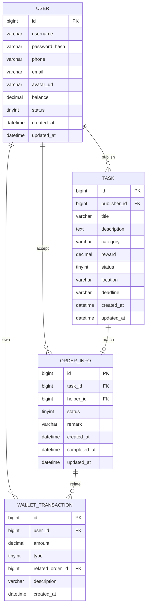

# 数据库设计文档

## 技术选型
- 数据库：MySQL 8.0
- 字符集：utf8mb4

## ER 图


## 数据表说明

### user
| 字段 | 类型 | 说明 |
|------|------|------|
| id | BIGINT | 主键 |
| username | VARCHAR(50) | 用户名，唯一 |
| password_hash | VARCHAR(255) | BCrypt加密密码 |
| phone | VARCHAR(20) | 手机号，唯一 |
| email | VARCHAR(100) | 邮箱 |
| avatar_url | VARCHAR(255) | 头像URL |
| balance | DECIMAL(10,2) | 钱包余额 |
| status | TINYINT | 1正常 0禁用 |

### task
| 字段 | 类型 | 说明 |
|------|------|------|
| id | BIGINT | 主键 |
| publisher_id | BIGINT | 发布者ID |
| title | VARCHAR(100) | 任务标题 |
| description | TEXT | 任务详情 |
| category | VARCHAR(20) | EXPRESS/FOOD/PURCHASE/OTHER |
| reward | DECIMAL(10,2) | 悬赏金额 |
| status | TINYINT | 0待接单 1进行中 2已完成 3已取消 |
| location | VARCHAR(255) | 任务地点 |
| deadline | VARCHAR(50) | 截止时间 |

### order_info
| 字段 | 类型 | 说明 |
|------|------|------|
| id | BIGINT | 主键 |
| task_id | BIGINT | 关联任务ID，唯一 |
| helper_id | BIGINT | 接单者ID |
| status | TINYINT | 0进行中 1已完成 2已取消 |
| remark | VARCHAR(500) | 备注 |
| completed_at | DATETIME | 完成时间 |

### wallet_transaction
| 字段 | 类型 | 说明 |
|------|------|------|
| id | BIGINT | 主键 |
| user_id | BIGINT | 关联user |
| amount | DECIMAL(10,2) | 正数入账，负数出账 |
| type | TINYINT | 1充值 2提现 3任务支付 4接单收入 |
| related_order_id | BIGINT | 关联订单ID |
| description | VARCHAR(200) | 流水说明 |

## 建表 SQL
```sql
CREATE TABLE IF NOT EXISTS user (
    id            BIGINT          NOT NULL AUTO_INCREMENT,
    username      VARCHAR(50)     NOT NULL,
    password_hash VARCHAR(255)    NOT NULL,
    phone         VARCHAR(20)     DEFAULT NULL,
    email         VARCHAR(100)    DEFAULT NULL,
    avatar_url    VARCHAR(255)    DEFAULT NULL,
    balance       DECIMAL(10, 2)  NOT NULL DEFAULT 0.00,
    status        TINYINT         NOT NULL DEFAULT 1,
    created_at    DATETIME        NOT NULL DEFAULT CURRENT_TIMESTAMP,
    updated_at    DATETIME        NOT NULL DEFAULT CURRENT_TIMESTAMP ON UPDATE CURRENT_TIMESTAMP,
    PRIMARY KEY (id),
    UNIQUE KEY uk_username (username),
    UNIQUE KEY uk_phone (phone)
) ENGINE=InnoDB DEFAULT CHARSET=utf8mb4;

CREATE TABLE IF NOT EXISTS task (
    id            BIGINT          NOT NULL AUTO_INCREMENT,
    publisher_id  BIGINT          NOT NULL,
    title         VARCHAR(100)    NOT NULL,
    description   TEXT            DEFAULT NULL,
    category      VARCHAR(20)     NOT NULL,
    reward        DECIMAL(10, 2)  NOT NULL,
    status        TINYINT         NOT NULL DEFAULT 0,
    location      VARCHAR(255)    DEFAULT NULL,
    deadline      VARCHAR(50)     DEFAULT NULL,
    created_at    DATETIME        NOT NULL DEFAULT CURRENT_TIMESTAMP,
    updated_at    DATETIME        NOT NULL DEFAULT CURRENT_TIMESTAMP ON UPDATE CURRENT_TIMESTAMP,
    PRIMARY KEY (id),
    KEY idx_publisher_id (publisher_id),
    KEY idx_status (status)
) ENGINE=InnoDB DEFAULT CHARSET=utf8mb4;

CREATE TABLE IF NOT EXISTS order_info (
    id            BIGINT       NOT NULL AUTO_INCREMENT,
    task_id       BIGINT       NOT NULL,
    helper_id     BIGINT       NOT NULL,
    status        TINYINT      NOT NULL DEFAULT 0,
    remark        VARCHAR(500) DEFAULT NULL,
    created_at    DATETIME     NOT NULL DEFAULT CURRENT_TIMESTAMP,
    completed_at  DATETIME     DEFAULT NULL,
    updated_at    DATETIME     NOT NULL DEFAULT CURRENT_TIMESTAMP ON UPDATE CURRENT_TIMESTAMP,
    PRIMARY KEY (id),
    UNIQUE KEY uk_task_id (task_id),
    KEY idx_helper_id (helper_id)
) ENGINE=InnoDB DEFAULT CHARSET=utf8mb4;

CREATE TABLE IF NOT EXISTS wallet_transaction (
    id                BIGINT          NOT NULL AUTO_INCREMENT,
    user_id           BIGINT          NOT NULL,
    amount            DECIMAL(10, 2)  NOT NULL,
    type              TINYINT         NOT NULL,
    related_order_id  BIGINT          DEFAULT NULL,
    description       VARCHAR(200)    DEFAULT NULL,
    created_at        DATETIME        NOT NULL DEFAULT CURRENT_TIMESTAMP,
    PRIMARY KEY (id),
    KEY idx_user_id (user_id)
) ENGINE=InnoDB DEFAULT CHARSET=utf8mb4;
```